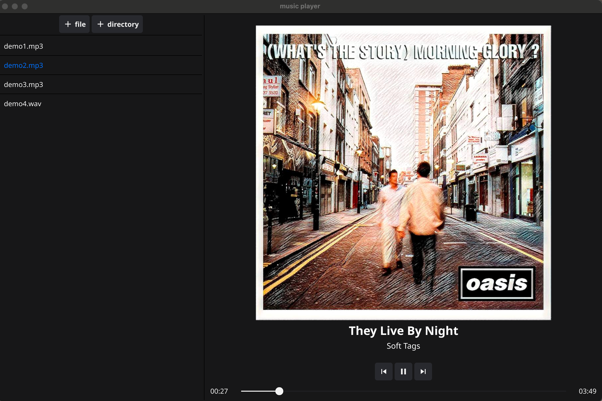

# Music Player
Destop music player written in go, UI framework use [Fyne](https://fyne.io/), audio playing use [Beep](https://github.com/faiface/beep).
Support **MP3** metadata parsing (ID3v2.3 AND ID3v2.4 only to extract album cover, title and artist) and playing, **WAV** only support playing.

## Features
- MP3 parsing and playing
- WAV playing
- Playlist support
- Album cover display (MP3 only)  
- Title and Artist info (MP3 only)  

## Screenshots


## Requirements
- Go: 1.24.x

## Installation
1. **Clone the Repo**
```bash
git clone https://github.com/gorgemul/musicplayer.git
cd musicplayer
```

2. **Download dependencies**
```bash
go mod tidy
```

3. **Run**
```bash
go run main.go
```
